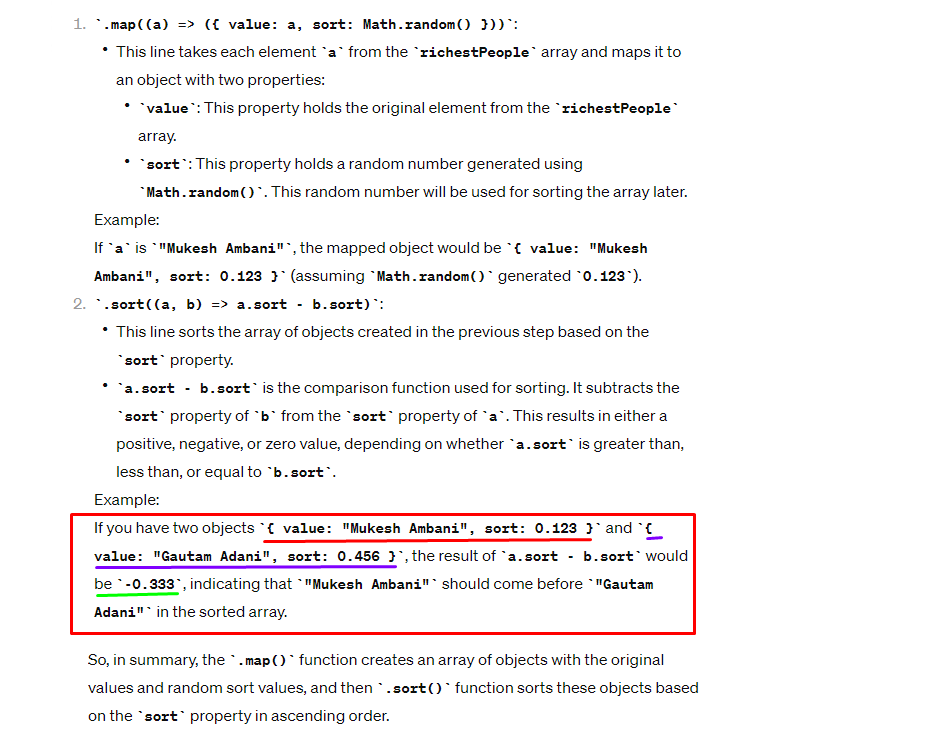
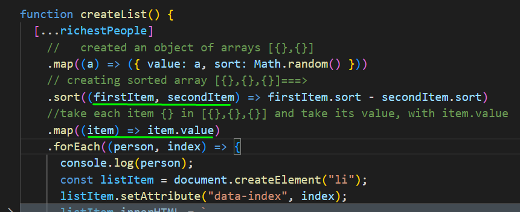

### Help me to understand this please, by showing what map returns, what is a.sort and b.sort?

```
Help me to understand this please, by showing what  map returns, what is a.sort and b.sort?
 .map((a) => ({ value: a, sort: Math.random() }))
    .sort((a, b) => a.sort - b.sort)
```



- in code, for better understanding: replaced variable names


